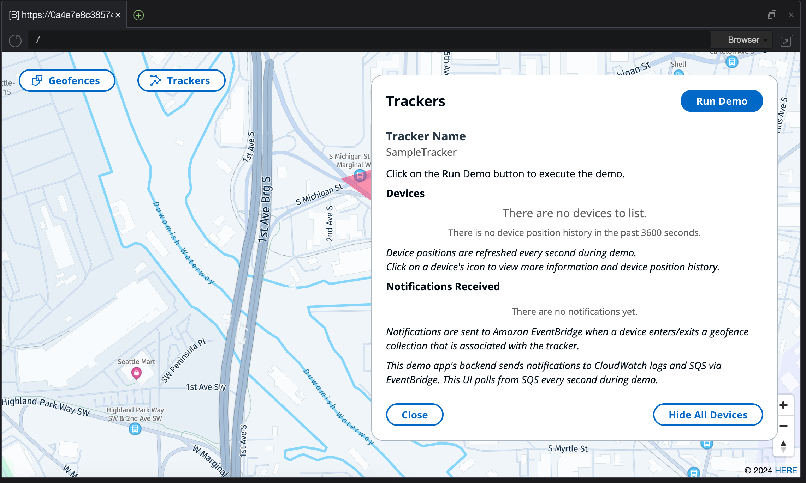

# Guidance for Tracking Assets & Locating Devices Using AWS IoT


## Table of Contents


1. [Overview](#overview)
    - [Cost](#cost)
2. [Prerequisites](#prerequisites)
    - [Operating System](#operating-system)
    - [AWS Account Requirements](#aws-account-requirements)
    - [Service Limits](#service-limits)
    - [Supported Regions](#supported-regions)
3. [Deployment Steps](#deployment-steps)
4. [Deployment Validation](#deployment-validation)
5. [Running the Guidance](#running-the-guidance)
6. [Next Steps](#next-steps)
7. [Cleanup](#cleanup)
9. [Revisions](#revisions)
10. [Notices](#notices)


## Overview

This Guidance demonstrates how to stream location data from your assets and devices with Internet of Things (IoT) sensors, helping you record and monitor the movement of your assets through a centralized management system. IoT-enabled devices, such as a smart bicycle, a delivery truck, or a shipping container, can be configured with AWS IoT Core, a fully managed service that lets you connect billions of IoT devices and route trillions of message topics to AWS. These message topics can then interface with a host of other AWS services, such as Amazon Location Service, which helps you add location data to your message topics. Other AWS services can be configured with this Guidance to alert you for geofencing events, allow you to receive location updates, and help you visualize asset positions from an interactive web application.

The demo contained in this repository configures the resources needed to send and visualize location updates via AWS IoT Core. An optional template also defines a basic analytics setup where location updates are stored in Amazon S3 for future analysis.

### Cost

You are responsible for the cost of the AWS services used while running this Guidance. As of April 2024, the cost for running this Guidance with the default settings in the US East (N. Virginia) region is approximately $94.80 per month for processing 1 million location updates.

The majority of the cost is location writes and retrievals from Amazon Location Service. Depending on how updates are [filtered](https://aws.amazon.com/blogs/mobile/amazon-location-service-enables-position-filtering-to-reduce-position-jitter-and-cost-of-tracking/) the cost to retrieve location updats may be less.

## Prerequisites
### Operating System

In order to visualize device positions and geofences, the application requires a local web server to be running. This deployment will assume the usage of Amazon Linux 2023 using AWS Cloud9. Running these steps on other operating systems may require additional steps. Additionally, the AWS Command Line Interface (CLI) will be required to deploy CloudFormation templates and interact with Amazon Location Service. Node.js is required for running the visualization.

### AWS Account Requirements

This deployment requires access to the following resources:

**Example resources:**
- Amazon Location Service
- Amazon EventBridge
- Amazon Data Firehose
- AWS Lambda
- Amazon S3
- Amazon SNS
- AWS IoT Core
- Amazon Cognito
- IAM roles with specific permissions
- Access to a Region that suppors this deployment [Default: US East (N. Virginia)]

### Service limits

Amazon Location Service supports a default limit of 50 Device Position Updates per second. If you anticipate updating at a higher rate, this limit can be increased via the [quota increase process](https://docs.aws.amazon.com/servicequotas/latest/userguide/request-quota-increase.html)

### Supported Regions

This guidance supports the following regions:

- US East (Ohio) - us-east-2
- US East (N Virgina) - us-east-1
- US West (Oregon) - us-west-2
- Asia Pacific (Mumbai) - ap-south-1
- Asia Pacific (Singapore) - ap-southeast-1
- Asia Pacific (Sydney) - ap-southeast-2
- Asia Pacific (Tokyo) - ap-northeast-1
- Canada (Central) - ca-central-1
- Europe (Frankfurt) - eu-central-1
- Europe (Ireland) - eu-west-1
- Europe (London) - eu-west-2
- Europe (Stockholm) - eu-north-1
- South America (Sao Paulo) - sa-east-1
- AWS GovCloud (US-West) - us-gov-west-1


## Deployment Steps
**1. Clone guidance and visualization repositories**

1. In a terminal, enter `git clone https://github.com/aws-solutions-library-samples/guidance-for-asset-tracking-using-aws-iot-core-and-amazon-location-services.git --recurse-submodules`
2. Navigate to `guidance-for-asset-tracking-using-aws-iot-core-and-amazon-location-services`


**2. Install Visualization prerequisites**

1. Navigate to the `amazon-location-samples-react/tracking-data-streaming` and run `npm install` to install required packages.
2. Run `chmod +x deploy_cloudformation.sh` to mark it as an executable file. 
3. Ensure your AWS Region is set by running `export AWS_REGION=<your region>`
3. Run `./deploy_cloudformation.sh`. This will install the Amazon Location Service Tracker and Map resources, Cognito authentication configurations, and a Kinesis stream designed to capture location updates.

**3. Configure Visualization**

1. Navigate to `guidance-for-asset-tracking-using-aws-iot-core-and-amazon-location-services/amazon-location-samples-react/tracking-data-streaming/src` and open the `configuration.js` file.
2. Navigate to the CloudFromation console and locate the `TrackingAndGeofencingSample` stack, and select the `Outputs` tab. Copy the values of `TrackingAndGeofencingSampleReadOnlyCognitoPoolId`, and `TrackingAndGeofencingSampleWriteOnlyCognitoPoolId` for the configuration file.
3. Change the values for `READ_ONLY_IDENTITY_POOL_ID`, `WRITE_ONLY_IDENTITY_POOL_ID`, and `REGION` with the values from CloudFormation.
4. Save the `configuration.js` file and run `npm start` to start the local web server.



**4. Configure IoT Resources Stack**
1. Navigate to `guidance-for-asset-tracking-using-aws-iot-core-and-amazon-location-services/cf` and enter the following command `aws cloudformation create-stack --stack-name TrackingAndGeofencingIoTResources --template-body file://iotResources.yml --capabilities CAPABILITY_IAM` Optionally, you can create the stack using the CloudFormation Console. This will deploy the IoT Core Rule, Lambda Function, and associated IAM Permissions to ingest messages from IoT Core into Amazon Location Service. 

**5. (Optional) Deploy Analytics Stack**

If you would like to include the analytics stack in the deployment, follow these steps.

1. Navigate to `guidance-for-asset-tracking-using-aws-iot-core-and-amazon-location-services/cf` and enter the following command `aws cloudformation create-stack --stack-name TrackingAndGeofencingAnalyticsResources --template-body file://analyticsResources.yml --capabilities CAPABILITY_IAM ` Optionally, you can create the stack using the CloudFormation Console. This will deploy an S3 Bucket, Data Firehose, EventBridge rule, and associated permissions to capture Location Updates from Amazon Location Service and place them in an S3 bucket for long-term storage and analytics.

## Deployment Validation - IoT and Analytics Resources

1a. Navigate to the AWS CloudFormation Console, and verify that the stacks 
`TrackingAndGeofencingIoTResources` and (optionally) `TrackingAndGeofencingAnalyticsResources` deployed successfully and are in `CREATE_COMPLETE` status 

OR

1b. Run the following commands `aws cloudformation describe-stacks --stack-name TrackingAndGeofencingIoTResources --query Stacks[0].StackStatus` and optionally `aws cloudformation describe-stacks --stack-name TrackingAndGeofencingAnalyticsResources --query Stacks[0].StackStatus` to verify they are both in `"CREATE_COMPLETE"` status.

## Deployment Validation - Visualization Resources
1. In your terminal, ensure `npm start` is still running.
2. Navigate to `localhost:8080` in your browser, or **Preview running application** if using AWS Cloud9 and verify the map is loading.

## Running the Guidance
To visualize your IoT Devices on the map and (optionally) store location updates in Amazon S3, send a location update via MQTT. Here is how:

### Sending MQTT Messages
In the AWS Console, navigate to **IoT Core** and then **MQTT test client**. In the **Publish to a topic** tab, enter `location` as the **Topic name** and the following for `Message payload`, setting the `timestamp` as the current epoch time. 
```json
{
  "payload": {
    "deviceid": "Vehicle-1",
    "timestamp": 1713812103,
    "location": { "lat": 47.54372304079714, "long": -122.32275832917712 },
    "accuracy": { "Horizontal": 20.5 }
  }
}
```
### Validating Location Update
To validate the Location update was sent from AWS IoT Core to Amazon Location Service, from your terminal, enter the following command: 
`aws location get-device-position --tracker-name SampleTracker --device-id Vehicle-1` which should produce output similar to this:
```json
{
    "Accuracy": {
        "Horizontal": 20.5
    },
    "DeviceId": "Vehicle-1",
    "Position": [
        -122.32275832917712,
        47.54372304079714
    ],
    "ReceivedTime": "2024-04-22T19:02:48.577000+00:00",
    "SampleTime": "2024-04-22T19:02:41+00:00"
}
```

### (Optional) Check S3 Bucket for Location Update
To validate Location Updates are being placed in S3 for long term storage and analytics, navigate to the Amazon S3 console and locate the bucket created as part of the analytics stack. Verify that files are being created in the bucket for each location update. Alternatively, use the AWS CLI to list the files in the bucket.


## Next Steps

This guidance provides a base framework from which you can build on top for your Asset Tracking Solution. With this guidance, you can modify certain aspects of this system to be tailored to your environment. This may include the following:

- Customization of data ingestion from other sources such as Kinesis
- Using Amazon Athena and Quicksight to perform and visualize location data stored on Amazon S3
- Notifications configured via Amazon Simple Notification Service for Geofence enter/exit events. 

## Cleanup

To cleanup, delete the following stacks in this order:
1. TrackingAndGeofencingIoTResources
2. TrackingAndGeofencingAnalyticsResources (empty the analytics bucket before attempting deletion)
3. TrackingAndGeofencingSample
4. serverlessrepo-kinesis-stream-device-data-to-location-tracker-app-stack
5. TrackingAndGeofencingSampleKinesisStack
6. Cloud9 instance


## Revisions

- First Release

## Notices

*Customers are responsible for making their own independent assessment of the information in this Guidance. This Guidance: (a) is for informational purposes only, (b) represents AWS current product offerings and practices, which are subject to change without notice, and (c) does not create any commitments or assurances from AWS and its affiliates, suppliers or licensors. AWS products or services are provided “as is” without warranties, representations, or conditions of any kind, whether express or implied. AWS responsibilities and liabilities to its customers are controlled by AWS agreements, and this Guidance is not part of, nor does it modify, any agreement between AWS and its customers.*

